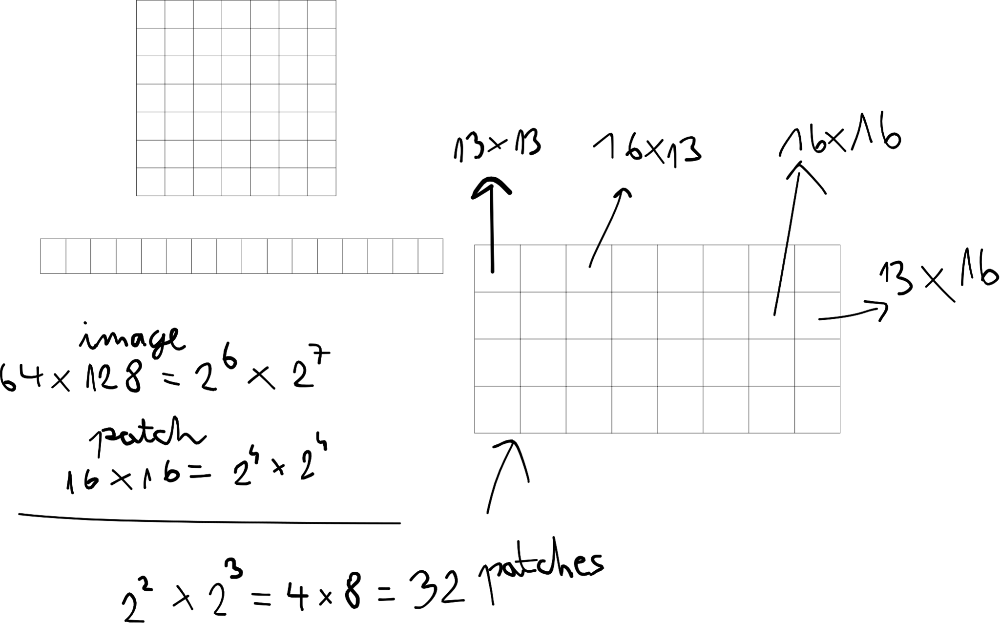
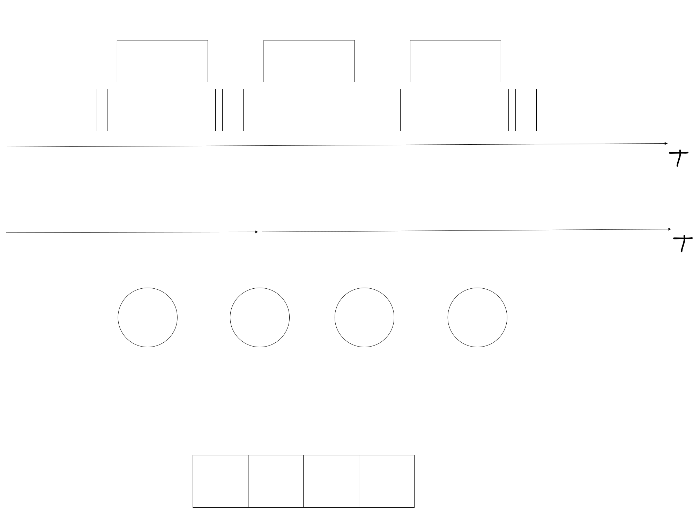

# Lote-stm32
learn on the edge - stm32g431cbu6 open source hil

## Setup repository 
Install following vscode extensions: clangd, pylance, c/c++
Add to include path in workspace vscode settings: ${workspaceFolder}/modules/libopencm3/include/**

```
sudo apt install gcc-arm-none-eabi cmake ninja-build dfu-util clangd git
```

```
git submodule update --init --recursive
cd firmware/modules/libopencm3
make TARGETS=stm32/g4
cd ../gaspar
./setup_requirements.sh
cd ../..
```

To run gaspar it is necessary to activate venv
```
source venv/bin/activate
```
To deactivete
```
deactivate
```

## Build

configure
```
cmake -B build-debug -G Ninja -DCMAKE_TOOLCHAIN_FILE=tools/arm-none-eabi-toolchain.cmake -DCMAKE_EXPORT_COMPILE_COMMANDS=ON

cmake --build build
```

## Update submodules

```
git submodule update --init --recursive

## Tools
Downloaded from: https://developer.arm.com/downloads/-/arm-gnu-toolchain-downloads
```

## Put board in dfu mode
Hold BOOT
Press RESET
Release RESET
Release BOOT

```
dfu-util -l
```

## flash
```
dfu-util -a 0 -s 0x08000000:leave -D firmware.bin
```

## Images

```
Statistics

max elapsed time(ms):  37.091732025146484  f(Hz)=  26.960186149356577
min elapsed time(ms):  33.417463302612305  f(Hz)=  29.924473648537774
avg elapsed time(ms):  35.06886959075928  f(Hz)=  28.515318904476526
std elapsed time(ms):  1.0081303954076437

max process elapsed time(ms):  21.162
min process elapsed time(ms):  17.316
avg process elapsed time(ms):  19.111092592592595
std process elapsed time(ms):  1.0930863493097978

Peak stack memory usage:  37.109375 %

```





```
Memory region         Used Size  Region Size  %age Used
         CCMSRAM:           0 B        10 KB      0.00%
             RAM:       21984 B        32 KB     67.09%
           FLASH:       25200 B       128 KB     19.23%
   text    data     bss     dec     hex filename
  24812     388   21596   46796    b6cc firmware.elf
```


